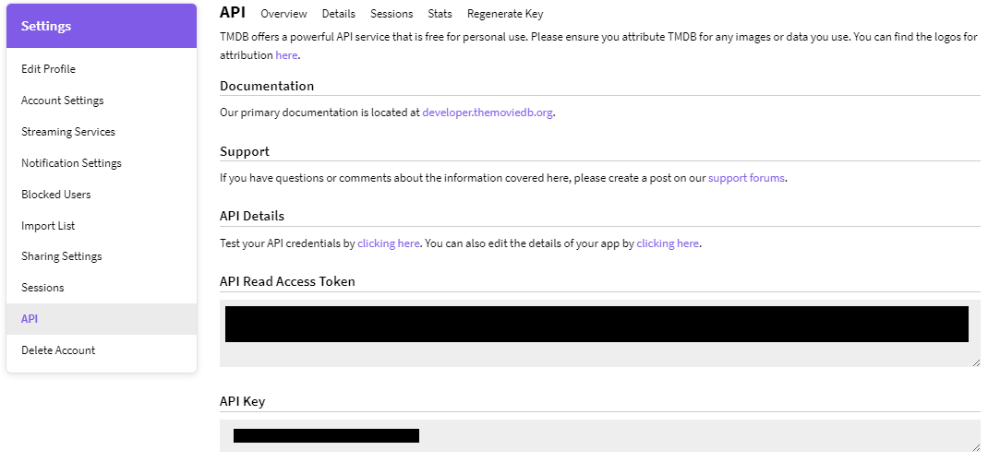

# [TMDB CLI Tool]https://roadmap.sh/projects/tmdb-cli
Use TMDB API to fetch movie information and display it in the terminal.

In this project, you will build a simple command line interface (CLI) to fetch data from The Movie Database (TMDB) and display it in the terminal. This project will help you practice your programming skills, including working with APIs, handling JSON data, and building a simple CLI application.

## How To Use CLI Tool

### 1. Register for an API Key from TMDB (link provided below). Copy and paste your **API READ ACCESS TOKEN** into text file and save it for subsequent steps.

[Getting Started](https://developer.themoviedb.org/docs/getting-started)



*Note: Do NOT share your **API KEY** nor your **API READ ACCESS TOKEN** with any unauthorized users.*

### 2. Open your terminal application and clone the repository.

```
git clone https://github.com/AF-Foysal/TMDB-CLI-Tool.git
```

### 3. While on the terminal, change directory into the cloned repository. 

```
cd TMDB-CLI-TOOL
```

### 4. Run the following command and paste your **API READ ACCESS TOKEN**
```
./mvnw spring-boot:run -Dspring-boot.run.jvmArguments="-Dtmdb.api.token={PASTE HERE}"
```
*Note: The braces are not included within the statement. They are solely there to show the user where to paste the necessary information into the command.*

### 5. Once the application is built, you will be met with the CLI. 

```
shell:>
```

### From here, you can utilize the following commands to access data from TMDB.

```
tmdb-app --type "playing"
tmdb-app --type "popular"
tmdb-app --type "top"
tmdb-app --type "upcoming"
```

## Tech Stack
- Java 
- Spring Boot
- Spring Shell
- Spring Reactive Web Client
